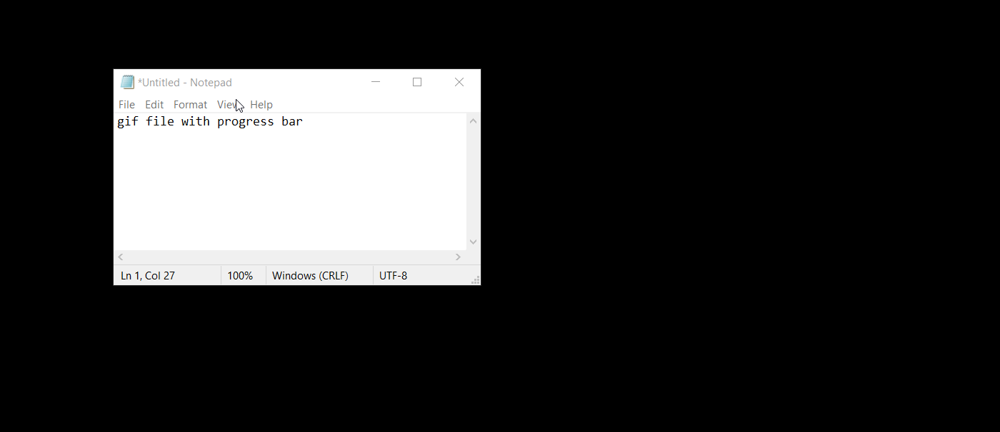

# gifTimelined
python tool for adding progress bar of timeline into gif file

## Prerequisites
### Install Python packages
```
pip install Pillow
pip install numpy
pip install pygifsicle
```

### Download gifsicle library for editing and optimizing gifs
for [OS Windows](https://eternallybored.org/misc/gifsicle/)

## Demo
### Usage
```
python gifTimelined.py "test.gif"
```
### Before

### After
